# 基于springboot的中小企业设备管理系统

---
### 👉作者QQ ：1556708905 微信：zheng0123Long (支持定制修改、部署调试、定制毕设)

### 👉接网站建设、小程序、H5、APP、各种系统等

---

#### 介绍

我开发了一个基于SpringBoot的中小企业设备管理系统，旨在帮助企业高效管理设备及其相关配件。系统设计了管理端、员工端和用户端三种角色，分别承担不同的管理和操作职能。该系统通过设备信息管理、设备购买、设备维护等模块，实现设备全生命周期的管理，提高设备使用效率，降低设备管理成本，增强企业的生产能力和竞争力。

#### 技术栈

后端技术栈：Springboot+Mysql+Maven

前端技术栈：Vue+Html+Css+Javascript+ElementUI

开发工具：Idea+Vscode+Navicate

#### 系统功能介绍

管理端功能模块

个人中心：管理员可以管理个人信息，修改密码等。  
用户管理：管理系统用户，添加、删除和编辑用户信息。  
员工管理：管理企业员工信息，分配员工角色和权限。  
设备信息管理：录入和管理设备的基本信息，包括设备的型号、规格、使用状态等。  
配件信息管理：录入和管理设备配件的基本信息。  
设备购买管理：管理设备的购买记录和流程。  
配件购买管理：管理设备配件的购买记录和流程。  
设备点检管理：定期检查设备的状态，确保设备的正常运行。  
设备润滑管理：管理设备的润滑记录，确保设备的良好运行状态。  
设备改造管理：记录和管理设备改造的信息，提高设备性能。  
事务报警管理：处理设备运行中出现的各类警报，及时采取措施。  
设备类型管理：分类管理不同类型的设备，方便查询和统计。  

员工端功能模块  

个人中心：员工可以管理个人信息，修改密码等。  
设备信息管理：查看和管理负责的设备信息。  
设备购买管理：参与设备购买流程，查看购买记录。  
设备报修管理：记录和管理设备报修情况。  
售后检修管理：记录和管理设备的售后检修信息。  
售后保养管理：记录和管理设备的售后保养信息。  
设备安装管理：记录和管理设备的安装信息。  
设备点检管理：定期检查设备的状态，确保设备的正常运行。  
设备润滑管理：记录设备的润滑信息，确保设备的良好运行状态。  
设备改造管理：记录和管理设备改造的信息，提高设备性能。  
事务报警管理：处理设备运行中出现的各类警报，及时采取措施。  

用户端功能模块

个人中心：用户可以管理个人信息，修改密码等。  
设备信息管理：查看和管理所使用的设备信息。  
配件信息管理：查看和管理设备配件信息。  
设备购买管理：参与设备购买流程，查看购买记录。  
配件购买管理：参与设备配件购买流程，查看购买记录。  
设备报修管理：记录和管理设备报修情况。  
售后检修管理：记录和管理设备的售后检修信息。  
售后保养管理：记录和管理设备的售后保养信息。  
设备安装管理：记录和管理设备的安装信息。  

#### 系统作用

提高设备管理效率：通过系统化管理设备和配件信息，提高设备管理的效率，减少人工操作的错误和遗漏。  
优化设备维护流程：通过点检管理、润滑管理、报修管理等模块，优化设备的维护流程，延长设备使用寿命，降低设备故障率。  
降低管理成本：系统化管理设备采购和维护记录，有效控制成本支出，减少不必要的浪费。  
增强数据透明度：系统提供详细的设备和配件信息，所有相关人员可以实时查看和管理数据，提高数据的透明度和准确性。  
提升企业竞争力：通过高效的设备管理和维护，提升企业的生产效率和设备利用率，增强企业在市场中的竞争力。  

#### 系统功能截图

代码结构

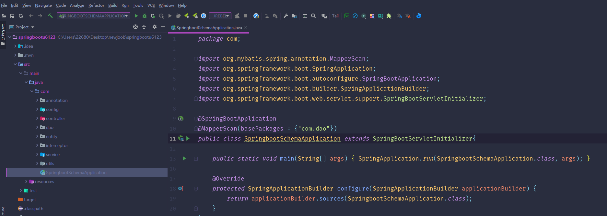

数据库表

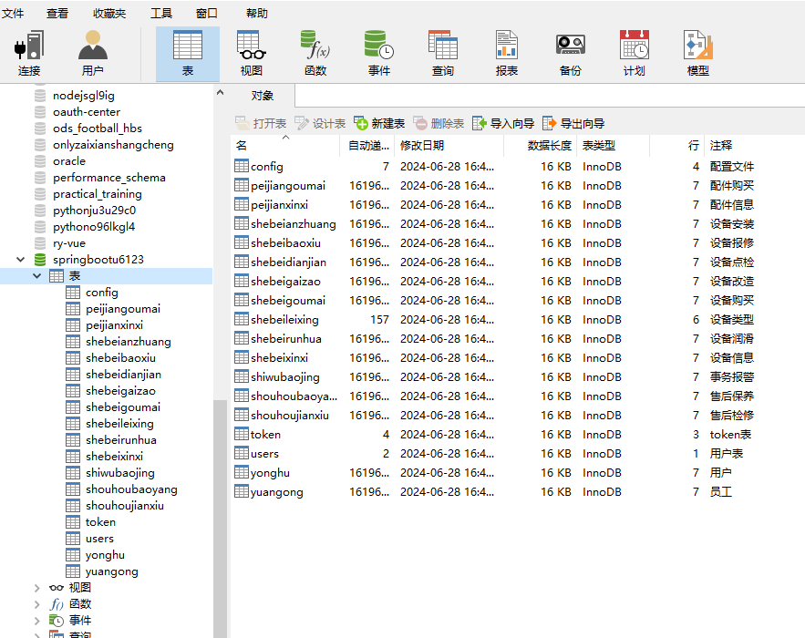

登录

用户端个人信息

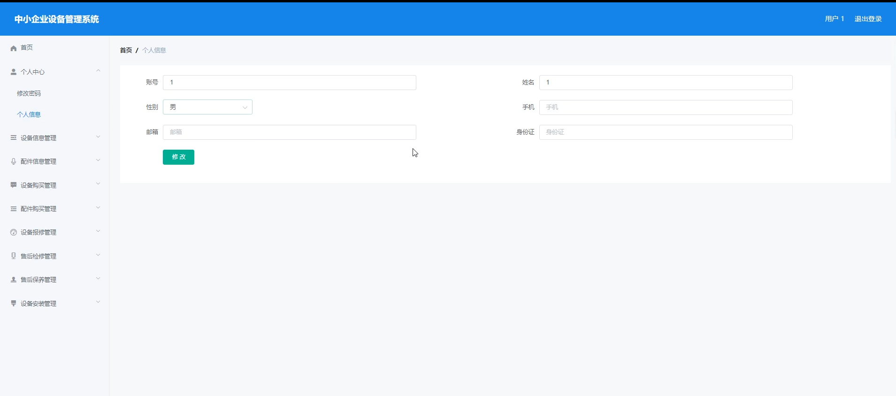

设备信息

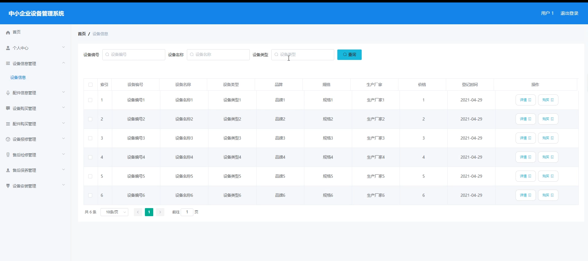

配件信息

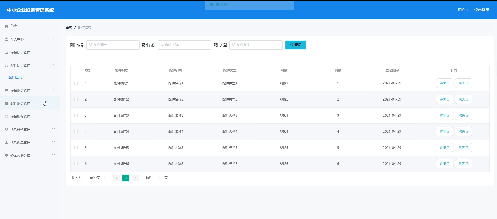

设备购买

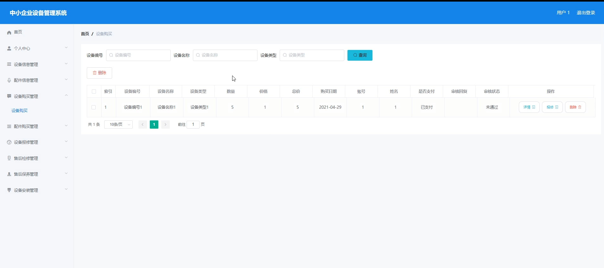

设备报修

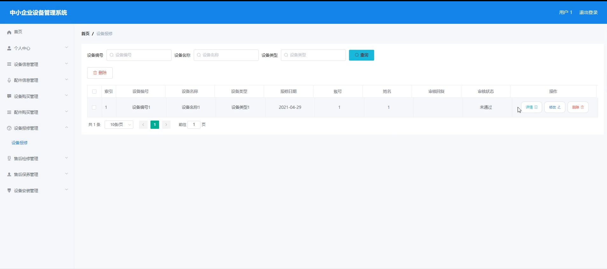

员工端设备购买

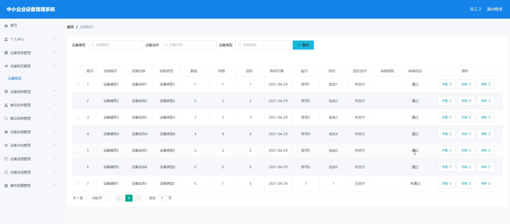

售后检修

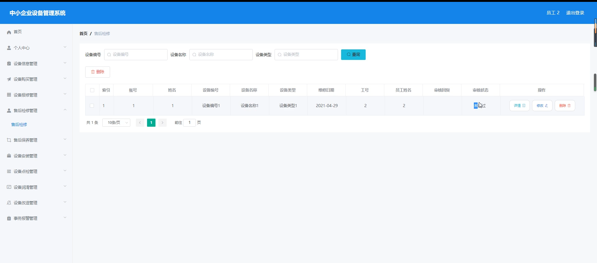

设备改造

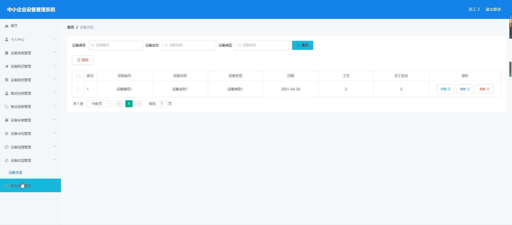

事务报警

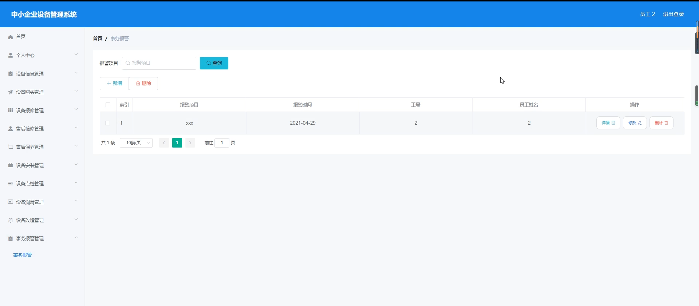

管理员端用户管理

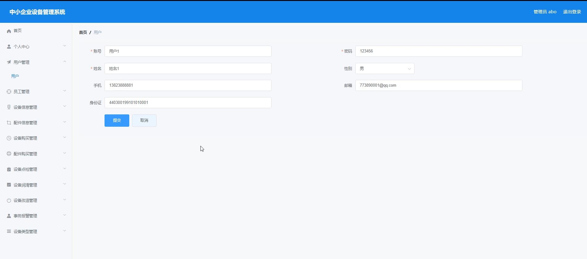

设备点检管理

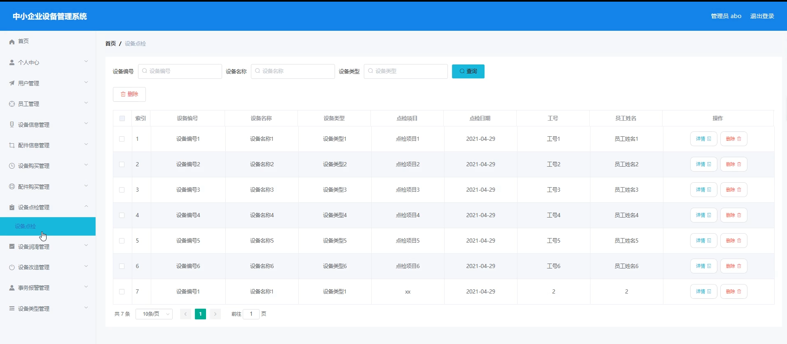

#### 总结

基于SpringBoot的中小企业设备管理系统，通过集成设备信息管理、设备购买、设备维护等功能模块，实现了设备全生命周期的系统化管理。该系统不仅提高了设备管理的效率和数据透明度，还有效降低了管理成本，优化了设备维护流程，为企业的生产和运营提供了有力的支持。系统的应用不仅提升了企业的设备管理水平，也增强了企业的生产能力和市场竞争力，为企业的发展奠定了坚实的基础。

#### 使用说明

创建数据库，执行数据库脚本 修改jdbc数据库连接参数 下载安装maven依赖jar 启动idea中的springboot项目

后台地址：http://localhost:8080/springbootu6123/admin/dist/index.html

管理员  abo 密码 abo
